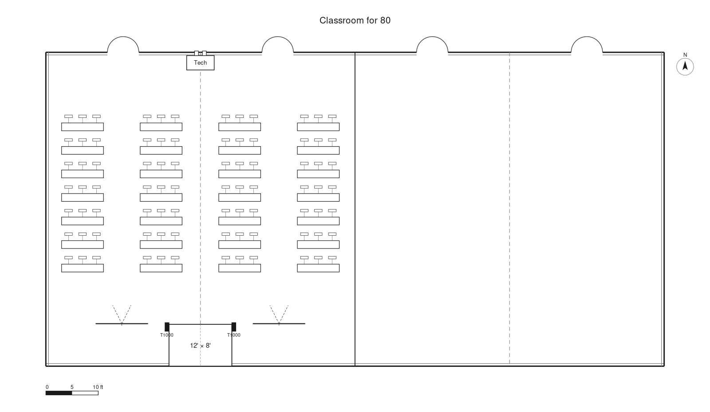

# Software 3.0 in Event Production

Karpathy's Software 3.0 applied to event production. Plain-English spec files — venue, inventory, event, playbook — drive AI-rendered floor plans.



## What's in this repo

```
software-3-event-production/
├── README.md                              ← this file
├── specs/
│   ├── venue_minnesota_valley.md          ← the room
│   ├── inventory.md                       ← the AV gear
│   ├── event_sample_group.md              ← one event's requirements
│   └── production_playbook.md             ← house rules the AI follows
└── renders/
    ├── sample_group_plan.png              ← the floor plan above
    └── sample_group_plan.svg              ← same plan, vector
```

The four documents in `specs/` are the program. The image in `renders/` is one output of that program.

---

# I Wrote My Event Setup in English. The AI Drew the Floor Plan.

I planned an 80-person event in a 118 × 60 ft ballroom using english as the programming language. I wrote three short specs in plain English; one describes the room, the second lists my equipment inventory, and finally one that describes the event. I prompted an AI to draw the floor plan and after a few follow-up prompts, to dial it in, there it was.

## Software 3.0, applied to a ballroom

Andrej Karpathy calls this **Software 3.0**. Software 1.0 was hand-written code, 2.0 was learned neural-network weights, 3.0 is the prompt. English is the programming language and AI is the runtime.

## Three documents in, one drawing out

The workflow is three plain-English files in a folder.

**Venue spec** — the room. Dimensions, doors, airwalls, ceiling height, fixed infrastructure (in our case, a permanent snake drop at the front-of-house position and no rigging points).

**Inventory spec** — the gear. Screens, mixer, speakers, projectors, each with my standard placement convention.

**Event spec** — this particular event. 80 people, classroom seating, two screens, a 12 × 8 ft stage, FOH at the snake drop.

I dropped all three in a folder and asked the AI to draw a floor plan in the style of my usual diagramming tool.

## The fourth file I didn't know I needed

The first three files describe *what is*, but the AI needs to be told *how to combine them*.

So I wrote a fourth file: the **playbook**. It holds the rules I'd been keeping in my head:

- Every chair faces the focal point. No exceptions.
- Minimum 8 ft between any screen and the first row of tables.
- Seating fills the available width.
- Projection screens center on the audience block they serve — with four seating columns and two screens, the screens sit on the aisles between cols 1–2 and cols 3–4, not at a fixed offset from the stage edge.
- Draw only what the specs document. No "industry standard" defaults unless the files explicitly call for them.

## Why this matters

The floor plan is just one output. The same documents can drive sales, labor estimates, vendor emails, bills of materials, load-in schedules. The asset isn't the drawing. The asset is the **spec set**.

## The bigger point

English is the new programming language. The spec is the program. The AI is the runtime.

---

## Use this on your own venue

Want to try this with your own ballroom and gear? Fork the repo and adapt the spec files.

1. **Replace `specs/venue_minnesota_valley.md`** with a file describing your room. Dimensions, doors, fixed infrastructure, any quirks the AI needs to know about.
2. **Edit `specs/inventory.md`** to reflect the AV inventory, with the placement conventions you use.
3. **Rewrite `specs/event_sample_group.md`** as a description of one specific event — attendee count, format, seating style, stage size, the gear you want to deploy.
4. **Adjust `specs/production_playbook.md`** with your house rules. Add new rules as you discover the ones you've been keeping in your head.
5. **Point an AI at the folder** and ask it to draw the floor plan in whatever visual style you prefer. Expect a few rounds of correction; capture each correction as a new sentence in the playbook.

Over time, your spec set becomes your event-production software.

## License

[Choose one before publishing — MIT, CC BY 4.0, or All Rights Reserved are common.]
